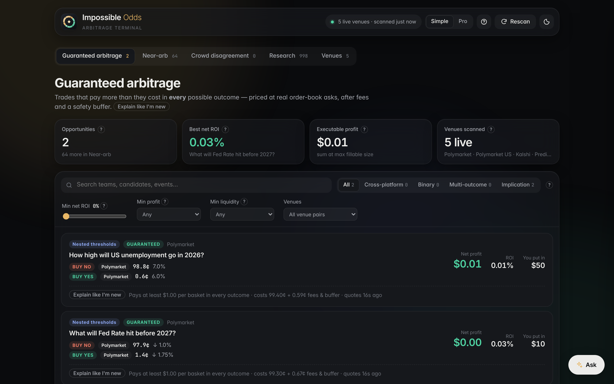
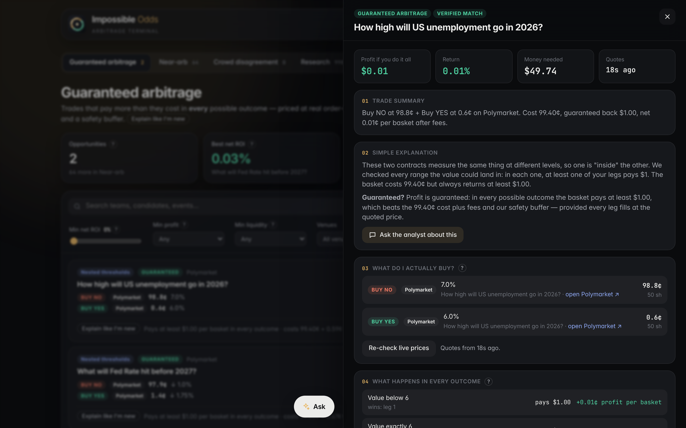
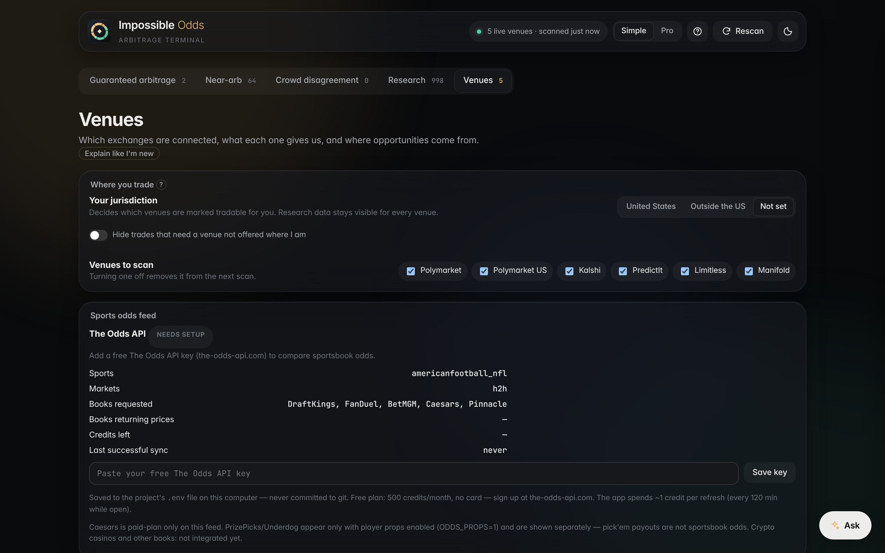

<p align="center"></p>

# Impossible Odds Detector

**A local prediction-market terminal that scans ~220,000 live contracts across Polymarket, Kalshi and four other venues and only calls something "arbitrage" when it provably pays in every possible outcome — after fees, order-book depth and settlement rules.**



## What it does

Prediction markets price the same real-world events on different venues, and related contracts on one venue (e.g. *"BTC above $90k"* vs *"BTC above $85k"*) must obey logic. When they don't, there can be free money — or, much more often, a trap: two contracts that *look* identical but settle on different dates, rules or tie-breaks.

The app pulls live markets from every venue, turns each one into a canonical contract spec, matches equivalent and logically related contracts field by field, prices candidate baskets against real order books, and sorts everything into:

| Tab | Meaning |
|---|---|
| **Guaranteed arbitrage** | Pays more than it costs in *every* outcome, at executable prices, after fees and a safety buffer, with a verified contract match and fresh quotes. |
| **Near-arb** | Looks profitable but one thing isn't certain: unverified match, a rare tail outcome, stale quotes, or a venue that hides order sizes. |
| **Linked markets** | Different contracts tied by logic — the live score ("a team trailing 24–20 that wins forces the total to 49+") or the tournament bracket ("World Series champion ⇒ pennant winner"). Proven, then priced as YES(consequence) + NO(cause). |
| **Crowd disagreement** | A prediction-market price vs. a margin-free consensus of sportsbooks (DraftKings, FanDuel, BetMGM, Pinnacle). A research signal, never labelled as profit. |
| **Research** | Logically impossible pricing (implication, exclusivity, exhaustive sets) that isn't tradable. |
| **Venues** | Honest live / partial / unavailable / needs-setup status per venue, eligibility by jurisdiction, and where matches come from. |

**Why I built it:** most "arbitrage scanners" match markets by title and happily show trades that lose money when the fine print differs. I wanted to see how much real, executable arbitrage exists once you're strict about it — and to build something a beginner can use without being misled. (Short answer: very little, and a correct empty screen beats a false positive.)

## Key features

- **6 venues, ~220k markets per scan** — Polymarket, Polymarket US, Kalshi, PredictIt, Limitless (all real money) and Manifold (play money, research only).
- **Field-by-field contract matching** — event, outcome, threshold, comparator, time window, geography, resolution source, tie and cancellation rules → `VERIFIED` / `LIKELY` / `MISMATCH`.
- **One correctness rule for every trade** — `min payoff across all valid states − cost − fees − buffer > 0`.
- **Order-book walking** — sizes each trade level by level with each venue's exact fee formula, and shows why it stops (book empty vs. next level unprofitable).
- **Sportsbook consensus** — implied probabilities → margin removed per book → freshness-weighted consensus that excludes the venue being judged.
- **Beginner mode + built-in analyst chat** — every number has an "explain like I'm new" popover; the chat answers using only the data on screen.
- **Local history** — timestamped quotes and signals saved with deduplication and retention, ready for a future backtester.
- **Zero runtime dependencies** — plain Node.js and browser ES modules. 65 automated tests.

<p>
  
  
</p>

## Tech stack

- **Backend:** Node.js 18+ (`http`, `fetch`, `zlib`, `child_process`) — no frameworks, no npm packages
- **Frontend:** vanilla JavaScript ES modules, hand-written CSS (light/dark, glass UI), inline SVG
- **Data:** Polymarket Gamma + CLOB APIs, Polymarket US gateway, Kalshi Trade API v2, PredictIt, Limitless, Manifold, The Odds API
- **AI chat (optional):** Claude via the local Claude Code CLI, or a local Ollama model, with a deterministic offline fallback
- **Tests:** Node's built-in `assert`, run with `npm test`

## Run it locally

```bash
git clone https://github.com/jtouevsky/impossible-odds-detector.git
cd impossible-odds-detector
npm start          # opens http://localhost:4173 — first scan takes 1–2 minutes
npm test           # 65 tests
```

No `npm install` needed (there are no dependencies). Everything works without keys. Optional extras:

- **Sportsbook odds** for the Crowd tab: get a free key at [the-odds-api.com](https://the-odds-api.com), then `cp .env.example .env` and set `ODDS_API_KEY` — or paste it in the app under **Venues → Sports odds feed**.
- **Claude answers in the chat:** install [Claude Code](https://docs.claude.com/en/docs/claude-code) and log in once; otherwise the built-in analyst answers.

All settings are listed in [`.env.example`](.env.example).

## Interesting technical problems

**1. Identical wording is not an identical contract.** Early versions matched an earthquake market to the same question for a different week, "Donald Trump Jr." to "Donald J. Trump", and — after adding Polymarket US — 99 "near-arbs" between a *full-game* total and a *3rd-quarter* total with word-for-word identical titles. The fix was a canonical `MarketSpec` per contract (`src/spec/`) and strict comparison: different dates, thresholds, periods or rule text is a mismatch, and missing rules can only ever produce `LIKELY`, never `VERIFIED`.

**2. Payoffs are intervals, not numbers.** Some venues settle a cancelled game at "a fair price" they choose. Each outcome state carries a payoff interval `[lo, hi]`, and the engine always uses the worst case. That's why cross-venue sports trades often land in Near-arb: the cancellation state can't be covered.

**3. Nested thresholds have dead zones.** Buying NO on "valuation hits $70B" and YES on "hits $75B" looks hedged until the value lands at $72B and both legs lose. `src/arb/statespace.js` splits the number line into every region (including the exact boundary points) and rejects any basket with a region that pays $0.

**4. Real prices, real fees.** Top-of-book screening finds candidates; then the engine walks actual order books with each venue's fee formula (Polymarket's `rate·(p(1−p))^exp`, Kalshi's per-order `ceil(0.07·C·p(1−p))`, Polymarket US's `0.0695·C·p(1−p)`), plus a safety buffer, and stops at the first level where the next basket would lose money.

**5. Scale without dependencies.** A full scan is ~220k markets. Getting it to run in under a minute without running out of memory meant caching a single `Intl.DateTimeFormat` (constructing one per market blew the heap), replacing all-pairs ladder comparison with neighbour-limited pairing, and blocking candidates by canonical event key before any pairwise matching.

**6. Honest sports consensus.** No-vig probabilities are only computed from a book's *complete* outcome set (never from one side). Books sharing a pricing feed count once, stale quotes decay to zero weight, and the venue being evaluated is excluded from its own reference. Sportsbook + exchange baskets are modelled in cash payouts, including pushes and voids — but because books don't publish bet limits, they're labelled *execution unverified* and can never enter the guaranteed feed.

**7. Proving links between different markets, exactly.** The Linked Markets engine turns each contract into constraints on the final score (winner ⇒ `a − b ≥ 1`, total over 48.5 ⇒ `a + b ≥ 49`, current score ⇒ `a ≥ 20, b ≥ 24`) and decides every outcome region with an exact integer feasibility procedure (`src/linked/solver.js`) — no sampling and no assumed maximum score. Ties, overtime rules, postponements and score corrections are modelled explicitly, and a proven structure is kept separate from execution readiness (fresh quotes, checked depth, known settlement).

**8. An AI assistant that can't make things up.** The chat sends a structured snapshot of the selected trade (legs, prices, books, fees, payoff table, match checks, rules) with every question. If Claude Code is installed, it runs headless with all tools disabled and API-key variables stripped, so it uses the local login instead of paid credits. A deterministic analyst answers from the same data when no model is available.

## Project structure

```
server.js              HTTP server, scan scheduling, cache, settings, API routes
src/providers/         one adapter per venue → common Market schema
src/spec/              canonical MarketSpec + strict matching
src/arb/               payoff rule, fees, state-space analysis, arbitrage engine
src/engine/            research pipeline (logical-inconsistency detectors)
src/sports/            sports schema, odds math, The Odds API adapter, consensus
src/chat.js            AI engine selection (Claude Code / Ollama / offline)
public/                browser UI (vanilla JS modules + CSS)
test/                  unit tests (npm test)
scripts/               live diagnostic scans (npm run arb / npm run scan)
```

## Possible future improvements

- Backtester over the saved quote history (how long do real arbitrages last?)
- More leagues and markets (spreads, totals and player props are supported by the adapter but off by default to save API credits)
- Smarkets and Betfair exchange adapters
- Price alerts when a guaranteed trade appears
- One-click order placement through venue APIs (with explicit confirmation)

## Disclaimer

Research software, not financial advice. Prices move, orders can fail to fill, and venue rules change — always re-check before trading, and only trade where you're legally allowed to.

## License

[MIT](LICENSE)
